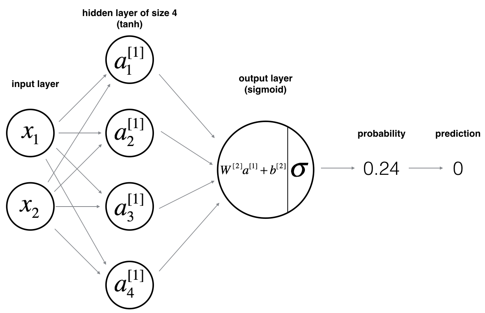

# Neural-network-with-one-hidden-layer
In this repo, I will demonstrate the common routine to set up a one-hidden-layer neural network. In particular, the following points will be addressed.

+ How a 2-class classification neural network with a single hidden layer can be implemented.
+ How units with a non-linear activation function, such as tanh or sigmoid can be used.
+ How to compute the cross entropy loss.
+ How to implement forward and backward propagation.

# 1 - Packages
Here are some useful packages that can be imported into the project.

+ [numpy](https://www.numpy.org) is the fundamental package for scientific computing with Python.
+ [sklearn](http://scikit-learn.org/stable/) provides simple and efficient tools for data mining and data analysis.
+ [matplotlib](http://matplotlib.org/) is a library for plotting graphs in Python.

# 2 - Dataset
It's usually a good habit to get some visual idea of the dataset that we have in hand, which we can use matplotlib to do so. In particular, you might want to ask yourself the following questions:

+ How many training examples do I have? In addition, what are the `shape` of the variables (usually just X and Y).
+ How do I get the shape of a numpy array? 

# 3 - Logistic regression
Before building a full neural network, it's not bad to first see how logistic regression performs on the problem concerned. We can use sklearn's built-in functions to train the model and then plot the decision boundary and print the accuracy. If the problem is not linearly separable, then logistic regression won't perform well. We then place our hope on the neural network.

# 4 - Neural Network model

**The model can be depicted as for example**:

*(Image credit: Coursera)*

**Or in terms of mathematical variables**:

*(Image credit: Coursera)*

**Remember**: The general methodology to build a Neural Network is to:

    1. Define the neural network structure ( # of input units,  # of hidden units, etc). 
    2. Initialize the model's parameters
    3. Loop:
        - Implement forward propagation
        - Compute loss
        - Implement backward propagation to get the gradients
        - Update parameters (gradient descent)

You often build helper functions to compute steps 1-3 and then merge them into one function we call `nn_model()`. Once you've built `nn_model()` and learnt the right parameters, you can make predictions on new data.
